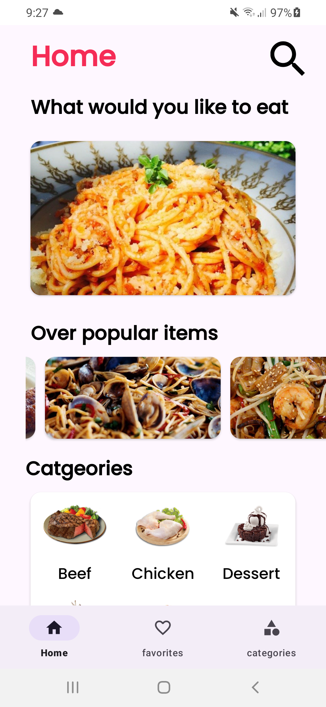
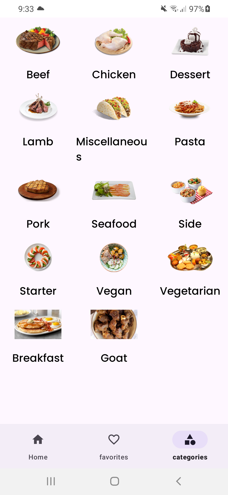

# FoodOrder

FoodOrder is a Kotlin-based mobile application designed to display meals using the MVVM (Model-View-ViewModel) architecture. The app fetches data from a food API via Retrofit, with Coroutines for handling asynchronous operations. It also allows users to search for meals, save their favorite meals, and view meal categories.

## Features

- Fetch all meal data from the API using Retrofit.
- Display meal categories and meals by category.
- Search for meals by name via a search icon.
- Long-click on a meal to open a Bottom Sheet Dialog with more options.
- View detailed information about each meal, including:
  - Meal picture
  - Category
  - Meal name
  - Instructions for preparing the meal
  - Button to add/remove the meal to/from favorites
  - Button to watch a YouTube video related to the meal preparation
- Add or remove meals from favorites by swipping.
- Save favorite meals in a Favorites fragment.
- Clean and structured architecture following the MVVM pattern.

## APK

You can download and install the APK from the following link:

[Download APK](app/build/outputs/apk/debug/app-debug.apk)

## Technologies Used

- **Kotlin**: Programming language used for Android development.
- **MVVM Architecture**: Ensures separation of concerns by organizing code into Model, View, and ViewModel.
- **Retrofit**: For making HTTP requests to the food API.
- **Coroutines**: For handling background tasks asynchronously.
- **Room**: To save and retrieve favorite meals locally.
- **LiveData**: To observe and respond to data changes in the ViewModel.
- **Fragment Navigation**: To navigate between different fragments.
- **Bottom Sheet Dialog**: Used for displaying more options when long-clicking on a meal.
- **Search Functionality**: Search meals by name via a search icon in the UI.
- **YouTube Video Link**: Watch a YouTube video of the meal preparation from the meal details page.

## API

The app uses the [MealDB API](https://www.themealdb.com/api.php) to fetch meal data and categories.

## Screenshots

| Home Screen                        | Categories Page                     | Meal Page                         |
|------------------------------------|-------------------------------------|-----------------------------------|
|  |  |  |

| Favorites Page                     | Search Results                      | Bottom Sheet Dialog on Long Click |
|------------------------------------|-------------------------------------|-----------------------------------|
|  |  |  |

| On Category Click                  |
|------------------------------------|
|  |

## Architecture

The app follows the MVVM architecture pattern:
- **Model**: Handles data-related operations, including retrieving data from the API or local database.
- **ViewModel**: Acts as a bridge between the View and Model, managing data streams using LiveData and Coroutines.
- **View**: Displays data and handles user interactions. Fragments represent different views like Home, Categories, and Favorites.
